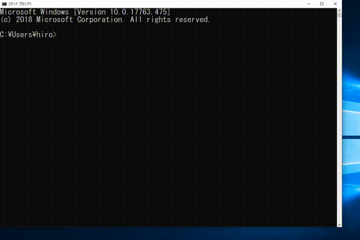

# unDavah

## unDavahって何？ (What is unDavah?)
unDavahは、PuTTYやWindows 10でのコマンドプロンプトなど、右クリックが即ペーストな環境で安全に作業するための小さなツールです。
現在のところ、AutoHotkeyから呼び出す形式をとっています。   
(unDavah is a small tool that lets you work safely in right-click paste environments, such as PuTTY and the Windows 10 command prompt. The current implementation works as a call from AutoHotkey.)  
ついでですが、紛らわしい文字については色分けし、ASCIIレンジ以外の文字については強調します。  
(In addition, similar characters are shown in different colors and characters outside the ASCII range are emphasized.)
  

## どんな役に立つの？ (How does it help?)
クリップボードに改行を含む文字列が入った状態でうっかりPuTTYのウィンドウで右クリック→一部コマンドとして実行される、という悲劇を防ぐために、いったんダイアログを表示して確認を求めます。   
(If you inadvertently right-click in the PuTTY window with a line break in the clipboard, some of it is executed as a command. To prevent that tragedy, we display a dialog once and ask for confirmation.)
## 動作 (How does it work?)
1. 呼び出された直後に、マウスポインタの位置を記憶します。  
(unDavah remembers the location of the mouse pointer immediately after it is called.)
2. 確認を求めるダイアログを表示します。  
(Then it displays a confirmation dialog.)
3. OKボタンを押されたときのみエラーコード0で正常終了します。その際にマウスポインタの位置を元に戻します。(それ以外はエラーコード1)  
(Next, exit with exit code 0 only when you press the OK button. The mouse pointer is then repositioned. (Otherwise, exit code 1))

これを利用してAHK側で、呼び出す前にunDavahが必要かどうかの判定を、終了後に右クリックする処理を行います。  
(The AHK must first determine if unDavah is required before calling it. Then, send a right click after finishing.)
## なぜ作ったか (Why did I write unDavah?)
元々はAHKスクリプトのみで実現していた機能ですが、マルチモニタ環境でモニタのスケーリングが混在している場合にうまく動作しないことがありました。調べてみると、マウスポインタの座標がうまく扱えていない様子ですし、また長大なテキストがクリップボードに入っているとダイアログが画面からはみ出すようなこともあったため、休暇を利用して作成しました。  
(Originally implemented only in AHK scripts, it does not work well with mixed monitor scaling in multi-monitor environments. I investigated the cause. As a result, I found that the coordinates of the mouse pointer were not handled well. Also, if I use it when I have long text on the clipboard, the dialog will overflow the screen. So I wrote this using during vacation.)

## AHKスクリプトのサンプル (Sample of AHK script)
バイナリを`C:\opt\unDavah\unDavah-PoC.exe`に配置したなら、次のように.ahkスクリプトから呼び出せます。  
(If you put the binaries in `C: \opt\unDavah\unDavah-PoC.exe`, you can call them from the .ahk script as follows:.)
```ahk
$RButton::
MouseGetPos,,, aWin
WinGetClass, aWinClass, ahk_id %aWin%
itsOK := 1

if ((aWinClass == "PuTTY") or (aWinClass == "ConsoleWindowClass") or (aWinClass == "mintty"))
{
    StringLen, length, clipboard 
    if(0 < length and RegExMatch(clipboard, "\n"))
    {
        RunWait, "C:\opt\unDavah\unDavah-PoC.exe"
        if (ErrorLevel > 0)
        {
            itsOK :=0
        }
    }
}
if (itsOK)
{
    MouseClick, RIGHT,,, 1, 0
}

return
```
## 動作環境 (System Requirements)
Windows 10のみ。  
(Only works with Windows 10.)  
バージョン1809(Windows 10 October 2018 Update)でのみ動作確認しています。  
(I only tested it on version 1809 [Windows 10 October 2018 Update].)
## その他 (miscellaneous notes)
最初のバージョンは、平成最後の日に書かれ、令和の初日に公開されました。  
(The first version was written on the last day of the Heisei era and released on the first day of the Reiwa era.)
